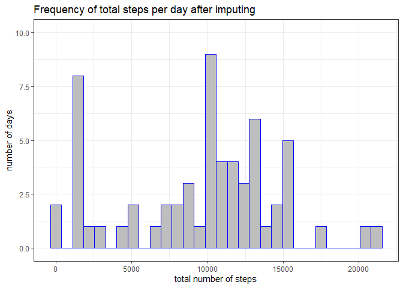

- R 4.3.0; RStudio build 446; Windows 10; 64 bit, 1.1 GHz processor; 4.00 GB RAM  
- two month activity data collected in October and November 2012  
- three columns: steps = missing as NA, number of steps taken in a 5 minute interval; date = date when measurement was taken, as YYYY-MM-DD; interval = identifier for 5 minute interval in which measurement was taken

### I. Load and preprocess the data  

**1. Set working directory**

**2. Load zip file, unzip file**

**3. Load file**


```r
#read file
activity <- read.csv("D:/Coursera_May_2023_JHU/Course5_Reproducible_Research/Week2_CourseProject1/activity.csv")
#look at summary
summary(activity)
```

```
##      steps            date              interval     
##  Min.   :  0.00   Length:17568       Min.   :   0.0  
##  1st Qu.:  0.00   Class :character   1st Qu.: 588.8  
##  Median :  0.00   Mode  :character   Median :1177.5  
##  Mean   : 37.38                      Mean   :1177.5  
##  3rd Qu.: 12.00                      3rd Qu.:1766.2  
##  Max.   :806.00                      Max.   :2355.0  
##  NA's   :2304
```

```r
print (paste(nrow(activity), "rows"))
```

```
## [1] "17568 rows"
```
**4. Change date class from character to date.time** using lubridate package.


```r
#load package
library(lubridate)
```

```
## Warning: package 'lubridate' was built under R version 4.3.1
```

```
## 
## Attaching package: 'lubridate'
```

```
## The following objects are masked from 'package:base':
## 
##     date, intersect, setdiff, union
```

```r
#change class from character to date
activity$date <- ymd(activity$date)
#double check class changed
class(activity$date)
```

```
## [1] "Date"
```
### II. What is the mean total number of steps taken per day?  

**1. Calculate the total number of steps taken each day.** 
Use dplyr package, group by date, then summarize by taking the sum for each date after removing NAs.


```r
#load package
library(dplyr)
```

```
## Warning: package 'dplyr' was built under R version 4.3.1
```

```
## 
## Attaching package: 'dplyr'
```

```
## The following objects are masked from 'package:stats':
## 
##     filter, lag
```

```
## The following objects are masked from 'package:base':
## 
##     intersect, setdiff, setequal, union
```

```r
#calculate sum of steps
steps_t <- activity %>% 
     group_by(date) %>% 
     summarise(total_steps = sum(steps, na.rm = TRUE))
```

- steps_t data frame has 61 observations and 2 variables

**2. Make a histogram** of the total number of steps taken each day, use ggplot2 package.


```r
#load package
library(ggplot2)
#create plot
ggplot(steps_t, aes(total_steps)) +
     theme_bw() +
     geom_histogram(fill = "gray", colour = "blue") +
     ylim(min = -0.1, max = 10.1) +
     labs(title = "Frequency of total steps per day before imputing", x = "total number of steps", y = "number of days")
```

```
## `stat_bin()` using `bins = 30`. Pick better value with `binwidth`.
```

<!-- -->

**3. Calculate the mean and median of the total number of steps.**


```r
total_mm1 <- paste ("mean1 = ", mean(steps_t$total_steps), "; median1 = ", median(steps_t$total_steps))
total_mm1
```

```
## [1] "mean1 =  9354.22950819672 ; median1 =  10395"
```

### III. What is the average daily activity pattern?  

**1. Make a time series plot** (i.e. type = "l") of the 5-minute interval (x-axis) and the average number of steps taken, averaged across all days (y-axis)

1.a. Average number of steps for each 5 minute interval across all days using dplyr.  


```r
steps_av <- activity %>% 
     group_by(interval) %>% 
     summarise(average_steps = mean(steps, na.rm = TRUE))
```

- steps_av has 288 rows and two columns; the 288 5-minute intervals covers 24hrs ((288*5)/60) = 24 hrs

1.b. Time series plot using ggplot2


```r
ggplot(steps_av, aes(x = interval, y = average_steps, group = 1)) +
     theme_bw() + 
     geom_line() +
     labs(title = "Average number of steps for each 5 minute interval before imputing", x = "5 minute interval", y = "average number of steps")
```

<!-- -->


**2. Which 5-minute interval,** on average across all the days in the data set, contains the maximum number of steps?


```r
steps_av[steps_av$average_steps == (max(steps_av$average_steps)), ]
```

```
## # A tibble: 1 × 2
##   interval average_steps
##      <int>         <dbl>
## 1      835          206.
```
- Interval 835, contains the maximum average number of steps across all days.

### IV. Imputing missing values  

- NA indicate missing values  

**1. Calculate and report the total number of missing values** in the dataset (i.e. the total number of rows with NAs).  
- From the summary in section I, the steps column has 2304 rows containing NAs
- double check each column


```r
paste("steps = ", sum(is.na(activity$steps)), " ;date = ", sum(is.na(activity$date)), " ;interval = ", sum(is.na(activity$interval)))
```

```
## [1] "steps =  2304  ;date =  0  ;interval =  0"
```
-  as with section I summary results, the steps column has 2304 rows with NAs  

**2. Plan for filling in missing values.**  
- Use the median for each interval.  
- From section II, 3b, there are 8 days with missing steps information.  
- Each day, the same 5 minute intervals are recorded: 288 5-minute intervals each day.  
- To create new data frame with imputed values:   
a. calculate median number of steps at each interval;  
b. subset columns containing median steps for each 5-min interval from steps_av data frame;  
b. subset rows with missing data from activity data frame;  
c. bind median column to rows with missing data to create activity_na2 data frame;   d. subset activity data frame for rows with complete data;  
e. bind activity_na2 to this data frame to create a new data frame with imputed missing values: activity2  

**3. Create new data frame**  

3.a. Calculate median steps for each interval


```r
steps_med <- activity %>% 
     group_by(interval) %>% 
     summarise(median_steps = median(steps, na.rm = TRUE))
```

3.b. Subset activity data frame for dates and interval columns (columns 2 & 3) with missing steps values


```r
activity_na1 <- activity[is.na(activity$steps), c(2:3)]
```

3.c. Subset steps_medcol for median steps located in column 2


```r
steps_medcol <- steps_med[ , 2]
```

3.d. bind columns; steps_medcol has 288 rows, whereas activity_na has 2304 rows; steps_medcol values will repeat itself until it fills out all the activity_na rows.  
 - also change column names to match activity data frame column names


```r
#bind columns
activity_na2 <- cbind(steps_medcol, activity_na1)
#change column names
colnames(activity_na2) <- c("steps", "date", "interval")
```

3.e. Subset activity data frame for rows with complete data only

```r
activity_complete <- activity[!is.na(activity$steps), ]
```

3.f. Bind activity_na2 and activity_complete rows, arrange by date, count number of NAs to check.


```r
#bind rows
activity2 <- rbind(activity_complete, activity_na2)
#arrange rows by date
activity2 <- activity2 %>% 
     arrange(date)
#count NAs to check imputation
sum(is.na(activity2))
```

```
## [1] 0
```
- new data frame with imputed values has 17568 rows, 3 columns  

**4. Make a histogram** of the total number of steps taken each day and Calculate and report the mean and median total number of steps taken per day.  
Do these values differ from the estimates from the first part of the assignment?  
What is the impact of imputing missing data on the estimates of the total daily number of steps?  

4.a. Calculate total number of steps taken each day


```r
steps2_t <- activity2 %>% 
     group_by(date) %>% 
     summarise(total_steps = sum(steps, na.rm = TRUE))
```

4.b. Histogram of total number of steps


```r
ggplot(steps2_t, aes(total_steps)) +
     theme_bw() +
     geom_histogram(fill = "gray", colour = "blue") +
     ylim(min = -0.1, max = 10.1) +
     labs(title = "Frequency of total steps per day after imputing", x = "total number of steps", y = "number of days")
```

```
## `stat_bin()` using `bins = 30`. Pick better value with `binwidth`.
```

<!-- -->


4.b. Mean and median of total steps taken per day  
- total_mm1 contains the mean and median before imputing  
- total_mm2 contains the mean and median after imputing


```r
#calculate mean and median of new data frame
total_mm2 <- paste ("mean2 = ", mean(steps2_t$total_steps), "; median2 = ", median(steps2_t$total_steps))
#print mean and median after imputing
total_mm2
```

```
## [1] "mean2 =  9503.86885245902 ; median2 =  10395"
```

```r
#print mean and median before imputing
total_mm1
```

```
## [1] "mean1 =  9354.22950819672 ; median1 =  10395"
```
- the median of imputed and non-imputed data sets were the same (10395 steps)  
- the mean after imputing was larger (9503) than the mean before imputing (9354)

### V. Are there differences in activity patterns between weekdays and weekends?

**1. Label weekdays vs. weekends**  

1.a. Use imputed data frame activity2, insert column "day" with weekday name using lubridate package loaded in section I


```r
#create new column by copying date column
activity2$day <- activity$date
#change values in day column to weekday name
activity2$day <- wday(activity2$day, label = TRUE, abbr = FALSE)
```

1.b. Create column "wday" with weekends and weekdays


```r
#create new column
activity2$wday <- activity2$day

#change class from factor to character
activity2$wday <- as.character(activity2$wday)

#replace Saturday and Sunday to weekend
activity2$wday[activity2$wday == "Saturday" | activity2$wday == "Sunday"] <- "weekend"
#days not already replaced to weekend will be replaced by weekday
activity2$wday[activity2$wday != "weekend"] <- "weekday"
```

**2. Make a panel plot** containing a time series plot (i.e. type = "l") of the 5-minute interval (x-axis) and the average number of steps taken, averaged across all weekday days or weekend days (y-axis). See the README file in the GitHub repository to see an example of what this plot should look like using simulated data.

2.a. Calculate average steps taken grouped by interval and wday (weekday vs weekend)


```r
steps2_av <- activity2 %>% 
     group_by(interval, wday) %>% 
     summarise(average_steps = mean(steps, na.rm = TRUE))
```

```
## `summarise()` has grouped output by 'interval'. You can override using the
## `.groups` argument.
```
2.b. Plot line graphs using ggplot2 package, arrange facets vertically dir = "v"; default is horizontal; set facet_wrap scales = "fixed" so both graphs have the same y-axis scales.


```r
ggplot(steps2_av, aes(x = interval, y = average_steps, group = 1)) +
     facet_wrap(~wday, dir = "v", scales = "fixed") +
     theme_bw() + 
     geom_line() +
     labs(title = "Average number of steps for each 5 minute interval after imputing", x = "5 minute interval", y = "average number of steps")
```

<!-- -->
  
2.c. Mean and median average steps on weekdays and weekends


```r
steps2_av %>% 
     group_by(wday) %>% 
     summarise(mean = mean(average_steps), median = median(average_steps), max = max(average_steps))
```

```
## # A tibble: 2 × 4
##   wday     mean median   max
##   <chr>   <dbl>  <dbl> <dbl>
## 1 weekday  31.2   20.8  205.
## 2 weekend  38.2   28.2  155
```
- The maximum average steps on weekdays was greater than the weekend (205 vs. 155 steps.  
- Weekend mean average and median average steps were higher than weekday average steps.  
